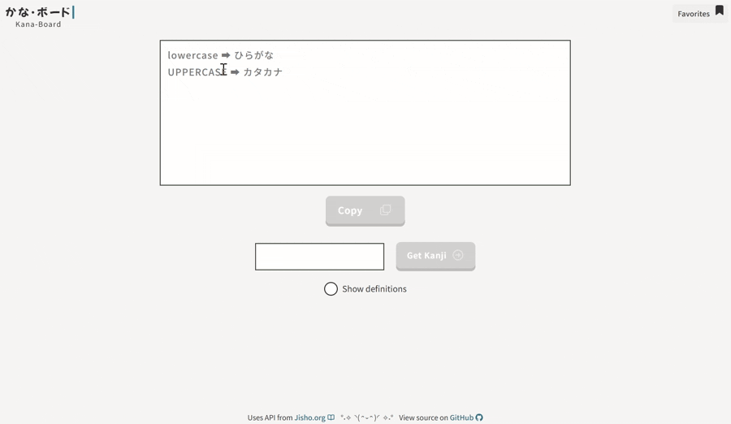
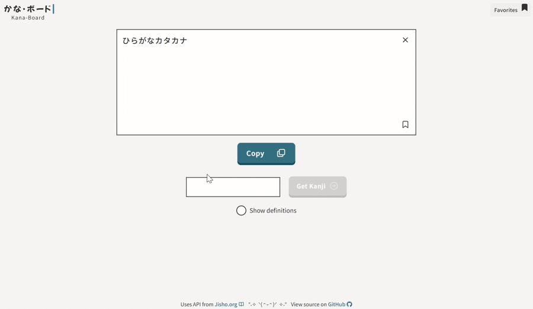
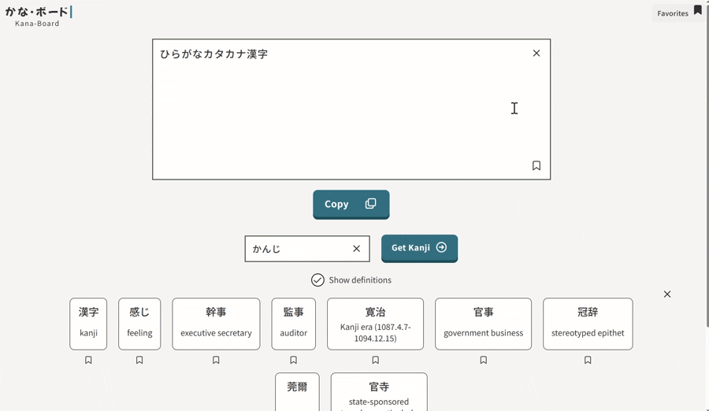
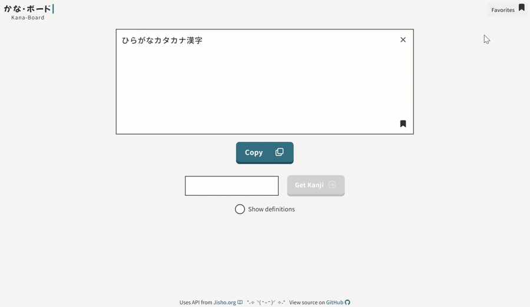
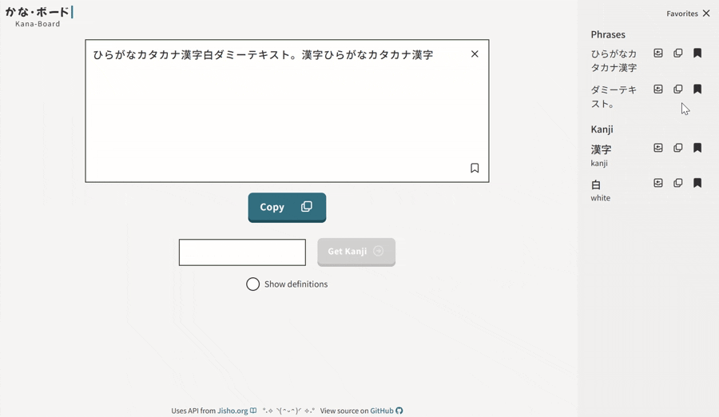

# Kana-board

Online Japanese keyboard with romaji to hiragana and katakana transliteration, and kanji search using the Jisho API. Favorite phrases and kanji are saved to the browser's localStorage.

React + TypeScript + Express rewrite of an older [Flask/jQuery version](https://github.com/leeqv/kana-board/) built for [CS50](https://www.edx.org/cs50).

Live demo: [kana-board.onrender.com](https://kana-board.onrender.com)

## About The Project
```
frontend/   React + TS app (Vite)
backend/    Express server that proxies requests to the Jisho API
```
Browsers block direct calls to Jisho (CORS), so the frontend calls the local Express server. The server fetches from Jisho and returns filtered results.

### Built With
- React 19 + TypeScript, Vite, SCSS
- Express (Node), CORS proxy in front of the Jisho API

## Getting Started

### Prerequisites
- [Node.js](https://nodejs.org/) `^20.19.0` or `>=22.12.0` (required by Vite 7)
- npm

### Installation
Run both apps in separate terminals.

**Backend** (`http://localhost:8080`):
```bash
cd backend
npm install
npm run dev
```
Scripts:
```bash
npm run dev   # Start with nodemon (auto-restarts on file changes)
npm start     # Start without file-watching
```

**Frontend** (`http://localhost:5173`):
```bash
cd frontend
npm install
npm run dev
```
Scripts:
```bash
npm run dev           # Lint styles, format, start the Vite dev server
npm run build         # Type-check and build for production
npm run lint          # Run ESLint
npm run lint:styles   # Lint SCSS/CSS with Stylelint
npm run format        # Format SCSS/CSS/TS/TSX with Prettier
npm run preview       # Preview the production build locally
```

Open `http://localhost:5173`.

## Usage

### Transliteration
Type in romaji to get hiragana and katakana, then copy the result.



### Kanji search
Search the Jisho API and pick a kanji to include in your sentence.



### Save phrases
Add a phrase to favorites to use it for later.



### Save kanji
Add a kanji to favorites to use it for later.


### Insert saved favorites
Insert a saved phrase or kanji into your sentence.



### Copy saved favorites
Copy a saved phrase or kanji to your clipboard.



## Credits
- Kanji search made possible using [Jisho.org](https://jisho.org/) API
- Inspired by Lexilogos' multilingual keyboard ([Japanese](https://www.lexilogos.com/keyboard/japanese.htm))
